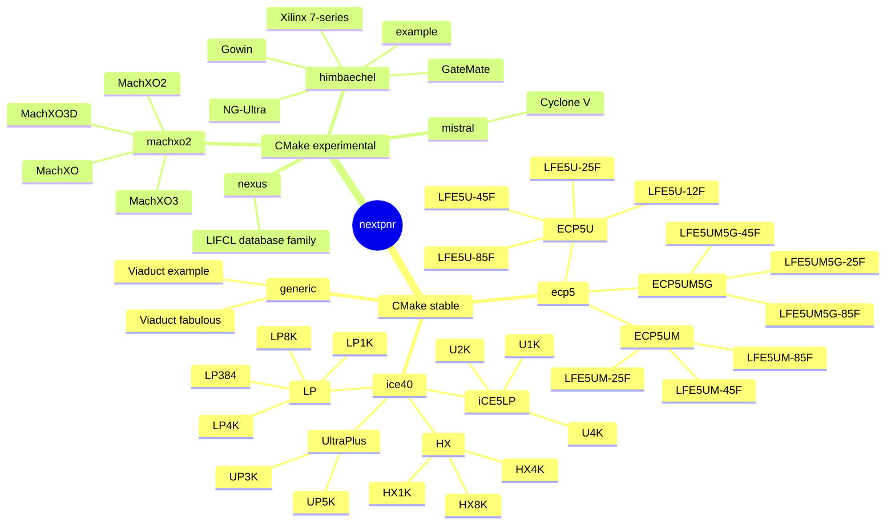
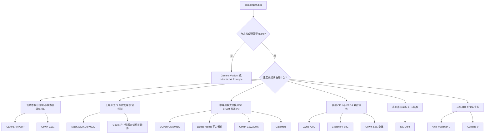
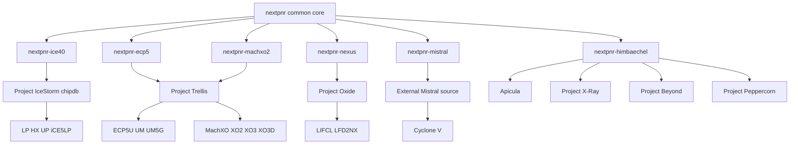

# 本地 nextpnr 支持的 FPGA 家族与器件

本文记录当前源码树能够构建的 nextpnr 架构后端、器件家族和基础型号，并解释常见型号的命名方式、资源规模及外部器件数据库依赖。

> 本文以本仓库的 `CMakeLists.txt`、各架构目录的 `CMakeLists.txt` 和命令行实现为支持范围的事实来源。它描述的是**当前源码快照**，不是所有 FPGA 厂商产品的全集。

## 1. 如何阅读本文

FPGA 型号通常有四层含义：

```text
架构/工艺家族 → 基础器件或密度 → 封装 → 速度与温度等级
```

例如：

```text
LIFCL-40-9BG400CES
│     │  │  │   └─ ES：Engineering Sample，工程样片
│     │  │  └──── BG400：BGA 400 引脚封装
│     │  └─────── -9：速度等级
│     └────────── 40：约 40K 逻辑规模档位
└──────────────── LIFCL：基于 Lattice Nexus 平台的 CrossLink-NX 器件前缀
```

nextpnr 的 CMake 列表并不总是枚举完整销售料号：

- iCE40、ECP5：CMake 主要枚举共享 chipdb 的密度档位，CLI 再选择逻辑型号。
- Nexus：CMake 只枚举数据库 family，完整型号来自 Project Oxide。
- MachXO：CMake 枚举基础 die，完整封装和速度组合来自 Project Trellis。
- Mistral：完整 Cyclone V 型号完全由外部 Mistral 源码决定。
- Himbächel：CMake 枚举微架构及基础器件，运行时加载独立 chipdb 文件。

### 1.1 资源数字的口径

不同厂商使用的资源单位并不等价：

| 单位 | 常见含义 |
|---|---|
| LUT | 查找表；最接近可直接比较的组合逻辑资源 |
| LC | Logic Cell，通常是厂商折算后的“逻辑单元” |
| LE | Logic Element；不同厂商内部结构不同 |
| CPE | GateMate 的可配置处理元素，不等同于传统 4/6 输入 LUT |
| EBR/BRAM/M10K | 片上块 RAM，块大小和工作模式不同 |
| DSP | 硬乘法器、乘加器或更复杂的 DSP slice |

因此本文遵循以下规则：

1. 型号中的 `1K`、`25K`、`50T` 等首先解释为**厂商标称密度档位**。
2. 标有“约”的数字用于系列比较，不应当作为综合容量保证。
3. 精确 BEL、RAM、DSP、PLL、SerDes 数量以实际构建所用 chipdb 和对应器件数据手册为准。
4. 两个名称相近的器件可能复用同一物理 die/chipdb，但通过资源屏蔽、速度、SerDes 或封装形成不同产品。

## 2. 本地支持树

顶层 `CMakeLists.txt` 注册了 7 个架构 family：



CMake 分组为：

```cmake
set(STABLE_FAMILIES generic ice40 ecp5)
set(EXPERIMENTAL_FAMILIES nexus machxo2 mistral himbaechel)
```

注意：README 仍把 generic 描述为 experimental，而顶层 CMake 已把它放入稳定构建集合。本文在讨论 `ARCH=all` 行为时以 CMake 为准。

## 2.1 为什么会有这么多 FPGA family

FPGA 不是单纯按照“LUT 越多越高级”排成一条线。不同产品面对的系统角色不同，芯片设计必须在以下属性之间取舍：

- **成本与芯片面积**：小 die、少量硬核资源通常更便宜，也更适合大量使用。
- **静态功耗与最高性能**：低漏电、低电压设计和高频、高速收发器设计很难同时做到最优。
- **启动方式**：SRAM FPGA 通常需要外部配置存储器；片上 Flash/非易失 FPGA 可以更快接管电源、复位和安全控制。
- **逻辑密度**：几百 LUT 的胶合逻辑与十几万 LUT 的图像、网络或加速设计需要完全不同的互连规模。
- **存储和计算硬核**：BRAM、DSP、PLL、DDR 控制器会节省大量 LUT，但也增加芯片面积和产品成本。
- **高速接口**：PCIe、SerDes、MIPI、LVDS 等接口需要专门模拟电路、封装和参考时钟资源。
- **处理器集成**：SoC FPGA 把 ARM 或其他 CPU 与可编程逻辑放在同一芯片上，软件与硬件可以通过片上互连协作，并可能减少器件数量和板级通信开销。
- **可靠性与安全性**：航空航天、功能安全和可信启动需要抗辐照、冗余、安全配置或生命周期管理。
- **封装和 I/O 数量**：同一逻辑 die 可以放入小 QFN，也可以放入高引脚数 BGA；可用 I/O 和硬核通道会随封装变化。

所以 family 的意义通常是：**针对一个应用角色，选择合适的工艺、逻辑架构、硬核资源、配置方式和封装组合**。同一家厂商保留多个 family，是为了避免所有用户都为自己不需要的资源付出面积、功耗和成本。

### 2.1.1 概念选型树

下面是帮助理解定位的概念图，不是性能排名或采购建议。图中同时包含 FPGA 产品家族、技术平台和 nextpnr 架构框架，三者不是同一分类层级：



### 2.1.2 各 family 的定位与存在原因

| 产品家族 / 平台 / 后端 | 主要定位 | 为什么单独形成这个对象 | 典型场景与主要取舍 |
|---|---|---|---|
| iCE40 LP | 小规模、低功耗、低成本 | 用较少硬核和较小互连满足控制逻辑，不必承担中端 FPGA 的面积和功耗 | 传感器接口、简单协议、胶合逻辑；容量和高速硬核有限 |
| iCE40 HX | iCE40 中偏性能的通用系列 | 与 LP 的低功耗侧重点区分，为更高性能或不同电压/封装需求提供选择 | 教学板、小型控制器、LED/音频/简单视频时序 |
| iCE40 UltraPlus | 小型低功耗，但加入 SPRAM 和 DSP | 纯 LUT 小 FPGA 很难高效完成缓存和乘加，因此增加片上大容量 SRAM 与计算硬核 | TinyML、音频、传感器预处理；逻辑规模仍属于小型 FPGA |
| ECP5U | 成本友好的中等规模 FPGA | 填补小型控制 FPGA 与高端 FPGA 之间的密度、BRAM、DSP 和 I/O 能力空档 | SDR、视频、网络桥接、中型软核系统；通常需要外部配置存储器 |
| ECP5UM/UM5G | ECP5 逻辑 fabric 加高速 SerDes | 高速串行模拟电路成本高，不需要 SerDes 的用户不必为它付费，因此分成 U、UM 和 UM5G 变体 | 多千兆链路、网络、视频传输；封装和高速 PCB 要求更高 |
| CrossLink-NX（Lattice Nexus 平台） | 新一代低功耗接口、桥接与中小型逻辑 | Nexus 技术平台着重低功耗、高 I/O 能力和现代接口，而不只是增加 LUT 数量 | 摄像头/显示桥接、嵌入式接口聚合；开源数据库成熟度依具体器件而异 |
| MachXO | 早期低密度、非易失控制 FPGA | 系统管理逻辑需要在主处理器和大型 FPGA 之前启动，非易失配置比纯 SRAM FPGA 更合适 | 电源时序、复位、板级控制；老器件数据库支持有限 |
| MachXO2/XO3 | Instant-on、系统管理和高 I/O 密度 | 延续非易失和快速启动定位，同时提高 I/O、逻辑密度和接口能力 | CPLD 替代、服务器/通信板管理、接口桥接 |
| MachXO3D | 安全配置和硬件信任 | 越来越多系统需要验证配置、保护密钥和建立可信启动链，因此从普通 XO3 分出安全变体 | 固件保护、可信启动、平台安全管理；安全流程比普通 FPGA 更复杂 |
| Cyclone V E/GX | 成熟的 Intel 中端 FPGA | E 偏成本优化且不含高速收发器；GX 增加高速收发器，面向通信和高速接口 | 工业、通信、采集、视频；本地 Mistral 后端仍为实验性 |
| Cyclone V SoC | FPGA fabric 与 ARM 处理系统集成 | CPU 擅长软件和控制，FPGA 擅长确定性并行数据通路；片上互连通常可减少器件数量和板级通信开销 | 嵌入式 Linux、实时控制、数据采集；启动和软件栈更复杂 |
| Gowin GW1 | 低成本、小封装、较高集成度 | 面向价格敏感和空间受限系统，以片上配置存储及多种小型变体降低外围器件数量 | 消费电子、接口扩展、小型控制；后缀对应的硬核能力需逐型号确认 |
| Gowin GW2 | 中等规模与更丰富硬核 | GW1 容量不足时，需要更多 LUT、BRAM、DSP 和 I/O，但仍保持成本导向 | 视频、控制、软核 CPU 和中型数据通路 |
| Gowin GW5 | 更新一代、较大规模和高速能力 | 面向更高密度、更高带宽和 SoC/SerDes 类需求，扩展到 GW1/GW2 难以覆盖的设计 | 图像、通信、高速接口；不同 A/AST/C 变体差异较大 |
| Spartan-7 | Xilinx 7-series 中的成本优化通用 FPGA | 保留成熟 7-series 逻辑和工具生态，减少高端接口资源以降低成本 | 工业控制、接口、通用逻辑；不适合依赖高速收发器的设计 |
| Artix-7 | 低功耗、成本优化但能力更完整的 7-series | 在 Spartan 与更高端 Kintex/Virtex 之间提供更高密度、DSP 和部分高速能力 | 通信、DSP、工业和原型；配置与电源系统通常比小 FPGA 复杂 |
| Zynq-7000 | 单核或双核 ARM Cortex-A9 + 7-series fabric | 把处理器、DDR/外设控制和可编程逻辑集成，减少 CPU 与 FPGA 之间的板级通信瓶颈；本文列出的 XC7Z010/XC7Z020 为双核型号 | 嵌入式 Linux、机器视觉、软件定义仪器；硬件与软件需协同开发 |
| NG-Ultra | 高可靠、抗辐照 SoC FPGA | 商业 FPGA 难以直接满足空间辐射和任务寿命要求，因此采用专门可靠性设计和验证流程 | 航空航天、卫星载荷和控制；成本、工具和供应渠道更专业 |
| GateMate | 基于 CPE 的通用 FPGA 与欧洲本土生态 | 使用不同于传统 LUT slice 的 CPE 架构探索面积、布线和算术实现方式，并提供另一套供应与工具生态 | 通用逻辑、算术和接口设计；CPE 数不能直接与 LUT 数横向比较 |
| Generic/Viaduct | 用户自定义和研究型架构 | 固定厂商后端不能描述任意 fabric，因此需要运行时构造的小型架构 API | 教学、架构研究、生成式 FPGA；不对应量产器件 family |
| Himbächel | 大型、多厂商共享后端框架 | 平铺路由图在十万级以上逻辑规模会占用巨大内存，因此通过 tile 类型和节点去重扩展到大器件 | Gowin、Xilinx、NG-Ultra、GateMate 后端基础设施；它本身不是芯片型号 |

### 2.1.3 同一家族为什么还有很多型号

即使 family 相同，厂商仍会按以下方式切分型号：

1. **密度分档**：例如 ECP5 的 25K/45K/85K，让用户只购买需要的逻辑规模。
2. **同 die 屏蔽资源**：较小销售型号有时复用较大 die，通过关闭一部分 LUT、RAM 或硬核形成产品档位；这也是多个 CLI 型号可以复用一个 chipdb 的原因。
3. **硬核分档**：例如 ECP5U、ECP5UM、ECP5UM5G 的主要区别之一是高速 SerDes 能力。
4. **封装分档**：相同 die 放入不同封装后，可用 I/O、差分对、SerDes 或存储接口数量可能不同。
5. **速度和温度等级**：同一逻辑资源数量可以按时序、工作温度和可靠性测试结果分级销售。
6. **安全或 SoC 变体**：MachXO3D、Zynq、Gowin 的部分后缀型号会增加安全、CPU 或专用接口能力。

这也解释了为什么完整目标描述通常需要区分 `architecture`、`device`、`package`，并在后端支持时区分 `speed`：只知道 family，仍不足以确定完整的 BEL、布线、引脚和时序模型。具体命令行参数形式因后端而异。

## 3. `nextpnr-generic`

`generic` 不对应某家厂商的固定 FPGA。它用于实验或描述用户自定义 fabric。

本地内置两个 Viaduct 微架构：

```text
nextpnr-generic
├── example   教学和 API 示例
└── fabulous  面向 FABulous 生成式 FPGA fabric
```

运行示例：

```sh
nextpnr-generic --uarch example ...
nextpnr-generic --uarch fabulous ...
```

它没有固定型号或资源表；资源规模由用户提供的 fabric 描述决定。

## 4. Lattice iCE40 / iCE5

构建目标：

```text
nextpnr-ice40
```

外部数据库：Project IceStorm。

### 4.1 型号树

```text
iCE40/iCE5
├── iCE40 LP：低功耗通用系列
│   ├── iCE40LP384
│   ├── iCE40LP1K
│   ├── iCE40LP4K
│   └── iCE40LP8K
├── iCE40 HX：偏性能系列
│   ├── iCE40HX1K
│   ├── iCE40HX4K
│   └── iCE40HX8K
├── iCE40 UltraPlus：低功耗并增加 SPRAM/DSP 等硬资源
│   ├── iCE40UP3K
│   └── iCE40UP5K
└── iCE5LP：Ultra/UltraLite 一代相关器件
    ├── iCE5LP1K
    ├── iCE5LP2K
    └── iCE5LP4K
```

### 4.2 命名方式

以 `iCE40HX8K-CT256` 为例：

- `iCE40`：产品家族。
- `HX`：系列定位；本后端中还包括 `LP`、`UP`。
- `8K`：标称逻辑规模档位，不代表恰好 8192 个 LUT。
- `CT256`：封装代码和引脚数量。

nextpnr 把器件和封装分开指定：

```sh
nextpnr-ice40 --hx8k --package ct256 ...
```

### 4.3 资源档位

| CLI | 基础型号 | 标称/约逻辑规模 | 资源特征 |
|---|---|---:|---|
| `--lp384` | iCE40LP384 | 384 LUT | 最小规模，适合胶合逻辑和小状态机 |
| `--lp1k` | iCE40LP1K | 约 1.3K LUT | 低功耗、带 EBR |
| `--lp4k` | iCE40LP4K | 约 3.5K LUT | 中小规模 LP |
| `--lp8k` | iCE40LP8K | 约 7.7K LUT | LP 系列较大档位 |
| `--hx1k` | iCE40HX1K | 约 1.3K LUT | 偏性能、带 EBR |
| `--hx4k` | iCE40HX4K | 约 3.5K LUT | 复用 8k 物理数据库 |
| `--hx8k` | iCE40HX8K | 约 7.7K LUT | 常见开源工具链教学器件 |
| `--up3k` | iCE40UP3K | 约 2.8K LUT | UltraPlus，具有 EBR、SPRAM、DSP 等资源 |
| `--up5k` | iCE40UP5K | 约 5.3K LUT | UltraPlus，常见特征是约 1 Mbit SPRAM 和 8 个乘加/DSP 块 |
| `--u1k` | iCE5LP1K | 约 1K 档 | iCE5LP/Ultra 系列 |
| `--u2k` | iCE5LP2K | 约 2K 档 | iCE5LP/Ultra 系列 |
| `--u4k` | iCE5LP4K | 约 4K 档 | iCE5LP/Ultra 系列 |

CMake 实际只生成 5 个共享数据库：

```text
384 → LP384
1k  → LP1K、HX1K
5k  → UP3K、UP5K
u4k → U1K、U2K、U4K
8k  → LP4K、HX4K、LP8K、HX8K
```

这说明“CLI 型号”和“物理数据库文件”不是一一对应关系。

## 5. Lattice ECP5

构建目标：

```text
nextpnr-ecp5
```

外部数据库：Project Trellis。

### 5.1 型号树

```text
ECP5
├── ECP5U：基本通用型号
│   ├── LFE5U-12F
│   ├── LFE5U-25F
│   ├── LFE5U-45F
│   └── LFE5U-85F
├── ECP5UM：带高速串行收发器的型号
│   ├── LFE5UM-25F
│   ├── LFE5UM-45F
│   └── LFE5UM-85F
└── ECP5UM5G：5 Gbit/s SerDes 型号
    ├── LFE5UM5G-25F
    ├── LFE5UM5G-45F
    └── LFE5UM5G-85F
```

### 5.2 命名方式

以 `LFE5UM5G-45F-8BG381C` 为例：

- `LFE5`：Lattice ECP5 产品家族前缀。
- `U`：ECP5U 基础系列。
- `M`：带高速串行相关资源的系列变体。
- `5G`：最高约 5 Gbit/s 的 SerDes 档位。
- `45F`：约 45K LUT 密度档位。
- `-8`：速度等级。
- `BG381`：381 引脚 BGA 封装代码。
- 最后的 `C`：温度/产品等级后缀之一，精确定义以数据手册为准。

### 5.3 资源档位

| 系列 | 支持密度 | 典型资源特征 |
|---|---|---|
| ECP5U | 12F、25F、45F、85F | LUT/FF、EBR、DSP、PLL；不以 5G SerDes 为卖点 |
| ECP5UM | 25F、45F、85F | 在相同逻辑密度基础上增加高速串行能力 |
| ECP5UM5G | 25F、45F、85F | 5G SerDes 变体 |

数字 `12/25/45/85` 是约 12K、25K、45K、85K LUT 的产品档位。精确 LUT、EBR、DSP 和 SerDes 通道数随密度、封装和变体变化。

CMake 只生成：

```text
chipdb-25k.bin
chipdb-45k.bin
chipdb-85k.bin
```

其中 `LFE5U-12F` 复用 `chipdb-25k.bin`。因此 `12k` 没有独立的 CMake 数据库选项，但它仍是受支持的运行时型号。

## 6. Lattice Nexus

构建目标：

```text
nextpnr-nexus
```

外部数据库：Project Oxide。

### 6.1 本地支持结构

```text
Nexus
└── LIFCL 数据库 family
    ├── LIFCL-17：CrossLink-NX，约 17K 逻辑档位
    ├── LIFCL-40：CrossLink-NX，约 40K 逻辑档位
    └── LFD2NX-*：可复用 LIFCL 数据库结构的相关 Nexus 变体
```

CMake 只枚举：

```cmake
set(ALL_NEXUS_FAMILIES LIFCL)
```

一份 `chipdb-LIFCL.bin` 可以包含多个密度、封装和速度组合。完整型号必须由编译时使用的 Project Oxide 数据库确认：

```sh
nextpnr-nexus --list-devices
```

### 6.2 命名方式

```text
LIFCL-40-9BG400CES
```

可安全解读为：

- `LIFCL`：CrossLink-NX（Lattice Nexus 平台）基础器件前缀。
- `40`：约 40K 逻辑规模档位。
- `9`：速度等级。
- `BG400`：400 引脚 BGA 封装。
- `C`：产品/温度等级后缀。
- `ES`：工程样片；正式量产器件不带该后缀。

Nexus 器件通常还包括 EBR、DSP、PLL 和高速 I/O 等硬资源，精确数量由完整料号和 Oxide chipdb 决定。

## 7. MachXO、MachXO2、MachXO3 与 MachXO3D

构建目标统一叫：

```text
nextpnr-machxo2
```

但它实际覆盖四代/四类器件。外部数据库来自 Project Trellis。

### 7.1 完整基础型号树

```text
nextpnr-machxo2
├── MachXO
│   ├── LCMXO256
│   ├── LCMXO640
│   ├── LCMXO1200
│   └── LCMXO2280
├── MachXO2
│   ├── LCMXO2-256
│   ├── LCMXO2-640
│   ├── LCMXO2-1200
│   ├── LCMXO2-2000
│   ├── LCMXO2-4000
│   └── LCMXO2-7000
├── MachXO3
│   ├── LCMXO3-1300
│   ├── LCMXO3-2100
│   ├── LCMXO3-4300
│   ├── LCMXO3-6900
│   └── LCMXO3-9400
└── MachXO3D
    ├── LCMXO3D-4300
    └── LCMXO3D-9400
```

### 7.2 命名与资源

型号中的数字基本表示标称 LUT/逻辑密度：

| 系列 | 基础型号 | 标称逻辑规模范围 | 定位 |
|---|---|---:|---|
| MachXO | 256、640、1200、2280 | 约 0.25K–2.3K LUT | 较早一代非易失、低密度控制 FPGA |
| MachXO2 | 256、640、1200、2000、4000、7000 | 约 0.25K–7K LUT | 控制、桥接、上电管理、胶合逻辑 |
| MachXO3 | 1300、2100、4300、6900、9400 | 约 1.3K–9.4K LUT | 更高 I/O 密度和接口桥接能力 |
| MachXO3D | 4300、9400（CMake 选择值为 `4300D`、`9400D`） | 约 4.3K/9.4K LUT | 带安全配置/硬件信任相关能力的变体 |

完整型号示例：

```text
LCMXO2-1200HC-4SG32C
```

- `LCMXO2`：MachXO2 家族。
- `1200`：约 1200 LUT 档位。
- `HC`：电压、性能或功耗变体代码。
- `-4`：速度等级。
- `SG32`：32 引脚封装代码。
- `C`：温度/产品等级后缀。

本地默认只构建 `1200` 和 `6900` 两个基础数据库。四个老 MachXO 项 `256X/640X/1200X/2280X` 虽然仍在允许列表中，但 CMake 注释指出它们在指定 Project Trellis 版本上导入失败。

## 8. Intel/Altera Cyclone V

构建目标：

```text
nextpnr-mistral
```

后端状态：实验性。外部模型：Mistral。

本仓库没有 Cyclone V 完整型号数组。它把 `--device` 字符串直接交给：

```cpp
mistral::CycloneV::get_model(...)
```

因此可用型号由 `MISTRAL_ROOT` 指向的外部源码决定。

### 8.1 型号示例

```text
5CSEBA6U23I7
```

可确定的主要层次是：

- `5C`：Cyclone V。
- `SE`：Cyclone V SoC 系列变体；同代还有纯 FPGA、GX/SX/GT 等不同产品线，但是否可用取决于 Mistral。
- `A6`：密度/器件档位代码的一部分。
- `U23`：封装代码。
- `I`：工业温度等级。
- `7`：速度等级。

中间其他字符是 Intel 的封装、收发器和器件选项编码，不应脱离该型号数据手册强行展开。

Cyclone V 采用 Intel 的 LE/ALM 资源口径，并可能包含 M10K RAM、DSP、PLL、硬核收发器以及 SoC 型号中的 ARM 处理器系统。精确资源完全取决于完整料号。

## 9. Himbächel 微架构

构建目标：

```text
nextpnr-himbaechel
```

Himbächel 不是 FPGA 厂商家族，而是面向较大器件、采用去重 tile/chipdb 的 nextpnr 共享架构层。

本地微架构为：

```text
Himbächel
├── example
├── gowin
├── xilinx
├── ng-ultra
└── gatemate
```

默认生成一个包含所选微架构的 `nextpnr-himbaechel`。设置 `HIMBAECHEL_SPLIT=ON` 后，每个微架构生成独立程序，例如 `nextpnr-himbaechel-gowin`。

### 9.1 Gowin

外部数据库：Project Apicula/Apycula。

```text
Gowin
├── GW1
│   ├── GW1N-1
│   ├── GW1NZ-1
│   ├── GW1N-4
│   ├── GW1NS-4
│   ├── GW1N-9
│   └── GW1N-9C
├── GW2
│   ├── GW2A-18
│   └── GW2A-18C
└── GW5
    ├── GW5A-25A
    └── GW5AST-138C
```

#### 命名与资源档位

| 基础数据库 | 型号标称档位 | 基本情况 |
|---|---:|---|
| GW1N-1 | 1K 档 | LittleBee 入门密度 |
| GW1NZ-1 | 1K 档 | GW1 低功耗相关变体 |
| GW1N-4 | 4K 档 | 小型控制和桥接 |
| GW1NS-4 | 4K 档 | GW1 SoC/专用功能相关变体 |
| GW1N-9 | 9K 档 | 中小规模 GW1N |
| GW1N-9C | 9K 档 | 与 `GW1N-9` 分开的 chipdb family 变体 |
| GW2A-18 | 18K 档 | Arora 系列中等规模 |
| GW2A-18C | 18K 档 | 与 `GW2A-18` 分开的 family 变体 |
| GW5A-25A | 25K 档 | Arora V 新一代器件 |
| GW5AST-138C | 138K 档 | 大规模、含高速/SoC 类硬资源的 GW5AST 变体 |

安全的命名解释是：

- `GW`：Gowin FPGA 前缀。
- `1/2/5`：产品代际或架构大类。
- `N/NZ/NS/A/AST`：系列和功能变体；精确定义以对应数据手册为准。
- 横线后的数字：标称 LUT 密度档位。
- 尾部 `A/C`：die、功能或集成变体标识；它不是 nextpnr 通用意义上的速度等级。

这些器件通常包含 BSRAM、DSP、PLL 和片上 Flash；具体数量随型号显著变化。CMake 列的是 chipdb family，不是全部封装销售料号。

### 9.2 AMD/Xilinx 7-series

外部数据库：Project X-Ray。下面列的是 CMake 可生成的基础 die 数据库候选，并不等于每项都已通过当前运行时代码。

> 当前实现限制：`xc7s50` 虽然出现在 CMake 的基础 die 列表中，但 Himbächel Xilinx 运行时器件匹配器尚未接受 `xc7s...`。在修复该匹配器并增加运行测试前，不能把 Spartan-7 视为实际可用后端。

```text
Xilinx 7-series
├── Artix-7
│   ├── xc7a50t
│   ├── xc7a100t
│   └── xc7a200t
├── Spartan-7
│   └── xc7s50
└── Zynq-7000
    ├── xc7z010
    └── xc7z020
```

运行时代码还允许 `xc7a35t` 复用 `xc7a50t` 数据库，但它不在默认 CMake 基础 die 数组中。

#### 命名方式

以 `xc7a100t` 为例：

- `xc`：Xilinx 器件前缀。
- `7`：7-series。
- `a`：Artix；`s` 表示 Spartan，`z` 表示 Zynq。
- `100`：厂商标称 Logic Cell 密度档位。
- `t`：该系列型号名的一部分；不能简单理解为实际 LUT 数量。

#### 资源规模

下表是常见厂商 selection table 口径，用于帮助理解型号档位；最终仍应以目标料号和实际 X-Ray chipdb 为准。

| 基础 die | 系列 | 约 Logic Cells | 约 LUT | BRAM | DSP slices | 其他关键资源 |
|---|---|---:|---:|---:|---:|---|
| xc7a50t | Artix-7 | 52,160 | 32,600 | 约 2.7 Mbit | 120 | 通用低成本 7-series |
| xc7a100t | Artix-7 | 101,440 | 63,400 | 约 4.9 Mbit | 240 | 中等规模 Artix-7 |
| xc7a200t | Artix-7 | 215,360 | 134,600 | 约 13.1 Mbit | 740 | 大规模 Artix-7 |
| xc7s50 | Spartan-7 | 52,160 | 32,600 | 约 2.7 Mbit | 120 | 成本优化、无硬核 ARM |
| xc7z010 | Zynq-7000 | 约 28K | 17,600 | 约 2.1 Mbit | 80 | 双核 ARM Cortex-A9 处理系统 + FPGA fabric |
| xc7z020 | Zynq-7000 | 约 85K | 53,200 | 约 4.9 Mbit | 220 | 双核 ARM Cortex-A9，常见 Zynq 教学/开发型号 |

注意：Xilinx “Logic Cells” 是营销折算口径，不能直接等同于 LUT；所以型号中的 `50/100/200` 与实际 LUT 数分别不同。

### 9.3 NanoXplore NG-Ultra

外部数据库：Project Beyond。

本地只枚举一个数据库级标识：

```text
ng-ultra
```

NG-Ultra 面向高可靠性、航空航天或抗辐照应用，属于大规模 SoC FPGA 类器件。它可能同时包含可编程逻辑、块 RAM、DSP、时钟和处理器/硬核接口资源，但本仓库的 CMake 名称没有编码密度，精确数量必须从所使用的 Project Beyond 数据库和 NanoXplore 器件手册取得。

README 还指出：生成最终二进制 bitstream 需要 NanoXplore 的 Impulse 工具。

### 9.4 Cologne Chip GateMate

外部数据库：Project Peppercorn。

当前启用：

```text
GateMate
├── CCGM1A1
└── CCGM1A2
```

命名可按以下层次理解：

- `CC`：Cologne Chip。
- `GM`：GateMate。
- `1`：第一代 GateMate 家族。
- `A1/A2`：具体 die/容量变体。

GateMate 使用 CPE（Configurable Processing Element）作为核心逻辑资源，不能直接把一个 CPE 当作一个传统 LUT。器件还包括块 RAM、PLL 和高速接口资源；乘法由 CPE 的专用工作模式实现。精确数量由 Peppercorn 数据库和器件数据手册决定。

源码注释中还出现：

```text
CCGM1A4 CCGM1A9 CCGM1A16 CCGM1A25
```

但它们未进入当前有效的 `ALL_HIMBAECHEL_GATEMATE_DEVICES`，因此不属于当前启用支持范围。

## 10. 后端、数据库与器件的关系



这些后端不是由一个统一 `nextpnr` 程序在运行时 `dlopen` 的插件。CMake 在配置阶段选择源码、编译宏和 chipdb 生成规则，然后生成独立的 `nextpnr-*` 可执行文件。

Himbächel 是一个例外形式：它可以把多个微架构编进同一个程序，但 chipdb 仍然是按微架构和基础器件分开的外部二进制文件。

## 11. 构建选择示例

只构建 iCE40：

```sh
cmake -S . -B build-ice40 \
  -DARCH=ice40 \
  -DICE40_DEVICES="384;1k;5k;u4k;8k"
cmake --build build-ice40 --parallel
```

构建 iCE40 与 ECP5：

```sh
cmake -S . -B build-lattice \
  -DARCH="ice40;ecp5"
cmake --build build-lattice --parallel
```

构建 Himbächel 的 Gowin 与 Xilinx 后端：

```sh
cmake -S . -B build-himbaechel \
  -DARCH=himbaechel \
  -DHIMBAECHEL_UARCH="gowin;xilinx" \
  -DHIMBAECHEL_SPLIT=ON \
  -DHIMBAECHEL_PRJXRAY_DB=/path/to/prjxray-db
cmake --build build-himbaechel --parallel
```

`ARCH=all+alpha` 会加入 `himbaechel`，但不会自动设置 `HIMBAECHEL_UARCH`；构建者仍需显式指定微架构。

## 12. 如何确认某次构建真正包含什么

源码支持范围不等于某个已安装二进制的实际范围。CMake 可以裁剪 chipdb，因此应优先查询当前程序：

```sh
nextpnr-ice40 --help
nextpnr-ecp5 --help
nextpnr-nexus --list-devices
nextpnr-machxo2 --list-devices
nextpnr-himbaechel --list-uarch
```

对于数据库驱动后端，还应确认安装目录中的 chipdb：

```text
share/nextpnr/<family>/chipdb-*.bin
share/nextpnr/himbaechel/<uarch>/chipdb-*.bin
```

完成 pack 后，nextpnr 打印的 utilisation 才是“当前设计使用了多少资源”的直接依据；而器件的理论上限应以当前加载 chipdb 的 BEL 数量为准。

## 13. 本地事实来源

支持范围和构建关系来自：

- `CMakeLists.txt`
- `ice40/CMakeLists.txt`、`ice40/main.cc`、`ice40/arch.cc`
- `ecp5/CMakeLists.txt`、`ecp5/main.cc`、`ecp5/arch.cc`
- `nexus/CMakeLists.txt`、`nexus/arch.cc`
- `machxo2/CMakeLists.txt`、`machxo2/facade_import.py`
- `mistral/CMakeLists.txt`、`mistral/main.cc`、`mistral/arch.cc`
- `generic/CMakeLists.txt`、`generic/viaduct/`
- `himbaechel/CMakeLists.txt`
- `himbaechel/uarch/*/CMakeLists.txt`

资源数字用于解释厂商命名与大致选型，不是 nextpnr 的稳定 API。升级外部 IceStorm、Trellis、Oxide、Mistral、Apicula、Project X-Ray、Project Beyond 或 Peppercorn 数据库后，实际支持的封装、速度等级和硬资源模型可能变化。
